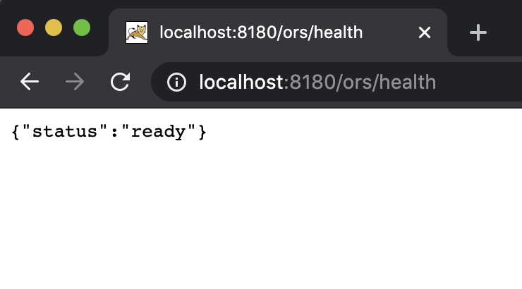
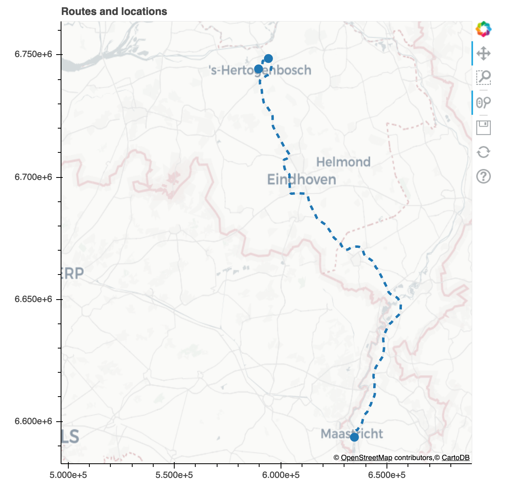

# Routing engine powered by open data

This is the repository that accompanies the Rubix blog post on using open data to build a routing engine.

You can find the blog by clicking this link.

## Instructions

If you already have an osm.pbf file follow the next instructions to build your route engine. Otherwise grab one that interests you from https://www.geofabrik.de/ 

First, clone the repository:

```$ git clone https://github.com/rcaroprese/docker-blog.git```

Copy your osm data file to _docker-blog/openrouteservice/docker/data/pbf/_ with the name **nb_li.osm.pbf**

### Routing engine

Once you have the data in the correct directory we can build the routing engine container. To do so, go to the following folder:

```$ cd docker-blog/openrouteservice/docker/```

And run:

```$ docker-compose up```

You will need to wait around 5 to 10 minutes before the process is complete. You can check the progress status by going to http://localhost:8180/ors/health. Once it says ready, you will have a routing engine running on your computer in the port 8180. Keep this terminal running.



### Visualizer

For the visualizer, in a different terminal, go to:

```$ cd docker-blog/viz```

Once again, run:

```$ docker-compose up```

You will be able to access a Jupyter notebook in port 8888.

If you modify the coordinates in the notebook and run all the cells you will see a map similar to the following:

